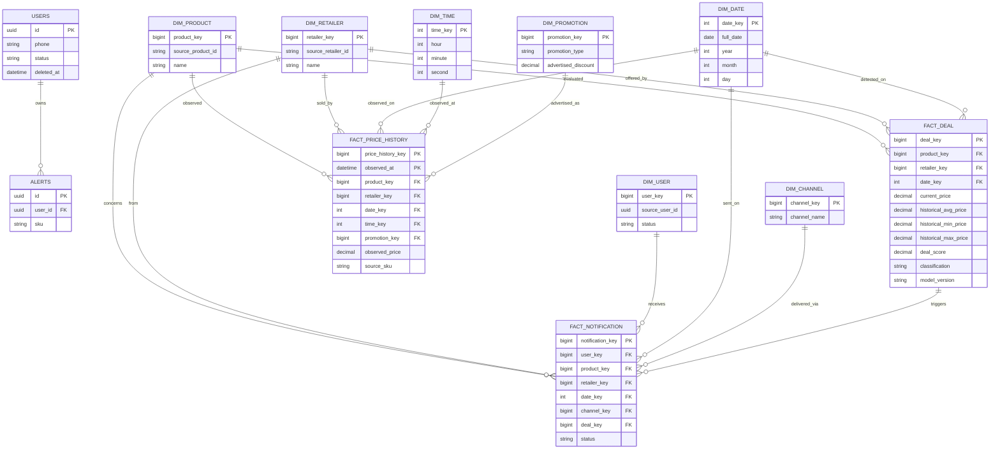

# El72 Data Architecture ERD

`USERS` and `ALERTS` are operational PostgreSQL entities. The dimensions and
facts are in the TimescaleDB `analytics` schema and map operational identifiers
through source columns rather than cross-database foreign keys.