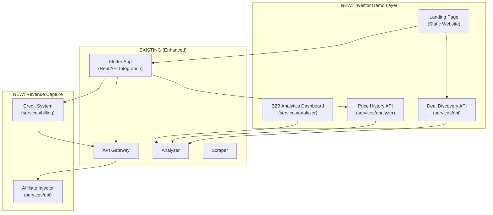

# El72 Investor-Readiness Sprint — Presentation Week Plan

## The Problem

El72 has a **solid engineering backbone** — event-driven microservices, ML anomaly detection, WhatsApp delivery, 97%+ test coverage — but it currently presents as **infrastructure looking for a product**. Investors don't fund architecture diagrams; they fund products that demonstrate **user traction mechanics**, **revenue capture**, and a **defensible moat** that can't be trivially cloned by adding a price-comparison tab to any existing e-commerce app.

### What Makes This NOT Just Another Feature?

The existential question an investor will ask: *"Why can't Amazon Egypt / Noon / Jumia just add a 'notify me when price drops' button and kill you overnight?"*

**Answer**: El72's moat is **cross-store intelligence + trust verification + WhatsApp-native distribution**.

- A single store will never tell you their competitor has it cheaper
- Existing trackers (Kanbkam — dead since 2022, Yaoota — 503'd) failed because they were passive comparison sites, not active deal-hunting agents
- WhatsApp delivery in Egypt is 10x more effective than email/push — and we've already solved the Meta template classification problem to keep costs at $0.0036/msg instead of $0.10/msg

**But the product doesn't demonstrate any of this today.** Here's what needs to change.

---

## Gap Analysis: What's Missing for Investor Demo

### 🔴 Critical Gaps (Product Won't Impress Without These)

| # | Gap | Why It Matters | Current State |
|---|-----|---------------|---------------|
| 1 | **No Landing Page / Product Website** | Investors visit your URL first. `frontend/public/` is empty. | Empty directory |
| 2 | **No Live Dashboard / Demo Mode** | Cannot show the product working without spinning up Docker + databases | Flutter app has mock data, no real API connection |
| 3 | **Billing is a skeleton** | Revenue model exists in `business_research.md` but code has mock HMAC, hardcoded fallback data, no actual credit system | [billing/main.py](file:///e:/repos/El72/services/billing/main.py) — 97 lines, mostly mock |
| 4 | **No Price History Visualization** | The killer feature (seeing price trends over time) has no UI | TimescaleDB stores data but no charts anywhere |
| 5 | **No Deal Discovery Feed** | Users can only track specific items — there's no "browse hot deals" experience | Deals tab has hardcoded mock data |
| 6 | **No Onboarding Flow** | No way to demonstrate the user journey: sign up → paste URL → get alert | Flutter auth exists but disconnected from backend |
| 7 | **Hardcoded secrets in docker-compose.yml** | WhatsApp access tokens in plain text in version control — security red flag for any technical due diligence | [docker-compose.yml L119](file:///e:/repos/El72/docker-compose.yml#L119) |

### 🟡 Important Gaps (Strengthen The Pitch)

| # | Gap | Why It Matters |
|---|-----|---------------|
| 8 | **No B2B Data Product Demo** | The "Blind Demand Data Feed" is your highest-margin revenue model but has zero UI |
| 9 | **No Affiliate Link Injection** | Revenue model #7 (programmatic affiliate stripping) is described but unimplemented |
| 10 | **No User Metrics / Analytics** | Can't tell investors "we have X users tracking Y items with Z% conversion" |
| 11 | **API has `print()` statements** | [main.py L83-86](file:///e:/repos/El72/services/api/main.py#L83-L86) — violates project standards, looks amateur in code review |
| 12 | **No rate limiting on API** | Any investor-side engineer will probe this |

---

## Proposed Architecture for Missing Pieces



---

## Workload Division: 3 AI Engineers

> [!IMPORTANT]
> Each engineer's scope is designed to be **fully parallelizable** — no blocking dependencies between them. They converge at the end for integration testing.

---

### 🟦 Engineer A — "The Storefront" (Product Surface & Landing Page)

**Mission**: Build the investor-facing surfaces — what they see before and during the demo.

#### Deliverables

##### 1. [NEW] Landing Page Website (`frontend/`)
- Premium, modern single-page marketing site (not a simple HTML page)
- Sections: Hero (animated price drop visualization), How It Works (3-step flow), Live Stats ticker, Pricing tiers, Egyptian market positioning
- Mobile-responsive, Arabic-ready layout direction
- Tech: Vite + vanilla JS/CSS (per project web standards)
- Real-time stats pulled from API (`/stats` endpoint — Engineer B provides)
- CTA: "Track Your First Deal" → deep-links to Flutter app or WhatsApp bot

##### 2. [MODIFY] Flutter App — Real API Integration (`flutter-app/`)
- Connect `auth_repository.dart` to live API (`/auth/register`, `/auth/login`)
- Connect `alerts_repository.dart` to live API (`/alerts`, `/tracked-items`)
- Build **Price History Chart** screen (fl_chart library) using new `/price-history/{sku}` endpoint
- Replace all mock data in `dashboard_page.dart` with Riverpod providers hitting real APIs
- Build proper onboarding flow: Welcome → Register (phone) → OTP → Dashboard
- Add **Deal Discovery Feed** screen consuming new `/deals/live` endpoint

##### 3. [NEW] Demo Mode Toggle
- Environment flag `DEMO_MODE=true` that seeds realistic Egyptian product data
- Allows running the full demo without needing live scraping
- Pre-populated price histories showing realistic price drops over time

#### Key Files
- [NEW] `frontend/index.html`, `frontend/src/main.js`, `frontend/src/style.css`
- [MODIFY] [dashboard_page.dart](file:///e:/repos/El72/flutter-app/lib/src/ui/dashboard/dashboard_page.dart)
- [MODIFY] [auth_repository.dart](file:///e:/repos/El72/flutter-app/lib/src/data/repositories/auth_repository.dart)
- [MODIFY] [alerts_repository.dart](file:///e:/repos/El72/flutter-app/lib/src/data/repositories/alerts_repository.dart)
- [NEW] `flutter-app/lib/src/ui/price_history/` — Chart screen
- [NEW] `flutter-app/lib/src/ui/deals/` — Deal discovery feed
- [NEW] `services/api/seed_demo_data.py` — Demo data seeder

---

### 🟩 Engineer B — "The Revenue Engine" (Billing, Credits, Affiliate, APIs)

**Mission**: Implement the actual money-making infrastructure and the APIs that power the demo.

#### Deliverables

##### 1. [MODIFY] Credit System (`services/billing/`)
- Implement the "Pay-As-You-Track" credit model from `business_research.md`
- Credit purchase flow via Paymob (Vodafone Cash / Fawry / InstaPay)
- Proper HMAC webhook validation (currently returns `True` always)
- Credit deduction on tracker creation, credit balance API
- Tiered pricing: Free (3 trackers), Standard (10 trackers, 30 EGP), Premium (unlimited, 90 EGP)
- New DB tables: `user_credits`, `credit_transactions`

##### 2. [NEW] Affiliate Link Injection (`services/api/`)
- Middleware that appends affiliate tracking tags when generating product URLs
- Store-specific affiliate programs: Amazon Associates Egypt, Noon Affiliate, Jumia KOL
- Click tracking via new `affiliate_clicks` table
- Revenue attribution: which deals drove which clicks

##### 3. [NEW] Public API Endpoints for Demo
- `GET /stats` — Platform-wide stats (total trackers, deals found today, total savings)
- `GET /deals/live` — Live deal discovery feed (recent confirmed deals, anonymized)
- `GET /price-history/{sku}` — Price history data for charting (from TimescaleDB)
- `GET /pricing` — Dynamic pricing tiers (replace current mock)
- Rate limiting middleware (slowapi) on all public endpoints

##### 4. [MODIFY] Security Hardening
- Remove hardcoded secrets from `docker-compose.yml` → use `.env` references
- Remove `print()` statements from API → proper `logging`
- Add API rate limiting
- Input validation on all new endpoints

#### Key Files
- [MODIFY] [billing/main.py](file:///e:/repos/El72/services/billing/main.py) — Full rewrite
- [MODIFY] [billing/models.py](file:///e:/repos/El72/services/billing/models.py) — Add credit models
- [NEW] `services/api/routers/deals.py` — Deal discovery endpoints
- [NEW] `services/api/routers/stats.py` — Platform stats endpoint
- [NEW] `services/api/routers/price_history.py` — Price history endpoint
- [NEW] `services/api/middleware/affiliate.py` — Affiliate link injection
- [NEW] `services/api/middleware/rate_limit.py` — Rate limiting
- [MODIFY] [api/main.py](file:///e:/repos/El72/services/api/main.py) — Replace print(), register new routers
- [MODIFY] [docker-compose.yml](file:///e:/repos/El72/docker-compose.yml) — Secret externalization
- [MODIFY] [schema.sql](file:///e:/repos/El72/infra/sql/schema.sql) — New tables

---

### 🟥 Engineer C — "The Intelligence Layer" (Analytics, B2B Dashboard, ML Enhancement)

**Mission**: Build the features that make El72 *defensible* — the intelligence that no competitor can replicate without our data.

#### Deliverables

##### 1. [NEW] B2B Analytics Dashboard (`services/analyzer/`)
- New FastAPI endpoints for retailer demand intelligence
- Anonymized aggregate data: "4,200 users in Cairo tracking RTX 5080 between 75K-78K EGP"
- Demand heatmaps by category, price bucket, and geography
- API: `GET /analytics/demand-summary`, `GET /analytics/category-trends`, `GET /analytics/price-sensitivity`
- This is the **highest-margin revenue stream** — demonstrate it working with real(istic) data

##### 2. [MODIFY] ML Enhancement — Deal Quality Scoring
- Current Isolation Forest detects anomalies but doesn't rank deal quality
- Add **Deal Quality Score** (0-100) combining: price drop magnitude, historical percentile, cross-store comparison, stock urgency
- Add **Fake Deal Detection**: flag suspicious patterns (price inflate then "discount", bundle-only pricing)
- These are the features that make the pitch: *"We don't just find price drops, we verify they're real"*

##### 3. [NEW] Platform Metrics & Instrumentation
- `GET /metrics/platform` — Investor-friendly metrics dashboard
- Total items tracked, total price points collected, anomalies detected, deals confirmed
- Average response time from price change to WhatsApp delivery
- Success rate of scrapes by store
- Integrate with existing Prometheus metrics in analyzer

##### 4. [NEW] Competitive Intelligence Module
- Cross-store price comparison for the same product (spec-matching)
- "Best price guarantee" data: across Amazon, Noon, Jumia — who has it cheapest?
- Historical price floor detection: "This is the lowest this item has EVER been across all stores"
- New endpoint: `GET /intelligence/cross-store/{product_id}`

##### 5. [MODIFY] Seed Data Pipeline
- Script to generate realistic Egyptian market price histories
- Simulated anomalies, seasonal patterns (Ramadan sales, Black Friday Egypt)
- Populate TimescaleDB with 90 days of synthetic but realistic data
- Critical for the demo — without this, all charts are empty

#### Key Files
- [MODIFY] [analyzer/app.py](file:///e:/repos/El72/services/analyzer/app.py) — New analytics endpoints
- [MODIFY] [ml_detector.py](file:///e:/repos/El72/services/analyzer/ml_detector.py) — Deal quality scoring
- [NEW] `services/analyzer/b2b_analytics.py` — B2B demand intelligence
- [NEW] `services/analyzer/deal_scorer.py` — Deal quality + fake deal detection
- [NEW] `services/analyzer/cross_store.py` — Cross-store intelligence
- [NEW] `services/analyzer/seed_data.py` — Synthetic data generator
- [NEW] `services/analyzer/routers/analytics.py` — B2B analytics API
- [NEW] `services/analyzer/routers/intelligence.py` — Cross-store API
- [MODIFY] [schema.sql](file:///e:/repos/El72/infra/sql/schema.sql) — Analytics tables (coordinate with Engineer B)

---

## Timeline (7 Days to Presentation)

| Day | Engineer A (Storefront) | Engineer B (Revenue) | Engineer C (Intelligence) |
|-----|------------------------|---------------------|--------------------------|
| **1-2** | Landing page design + build | Credit system DB + API | Seed data pipeline + synthetic histories |
| **2-3** | Flutter API integration | Affiliate injection + Deal/Stats APIs | B2B analytics endpoints |
| **3-4** | Price history chart + Deal feed | Security hardening + Rate limiting | ML deal quality scorer + fake deal detection |
| **4-5** | Onboarding flow + Demo mode | Paymob webhook hardening | Cross-store intelligence |
| **5-6** | Polish + responsive testing | Integration testing | Platform metrics dashboard |
| **6** | **Integration Day** — All three engineers converge | | |
| **7** | **Rehearsal Day** — Full demo run-through, bug fixes | | |

---

## Verification Plan

### Automated Tests
```bash
# Each engineer adds tests for their deliverables
pytest services/api/test_*.py -v          # Engineer B
pytest services/analyzer/test_*.py -v     # Engineer C  
pytest services/billing/test_*.py -v      # Engineer B
cd flutter-app && flutter test            # Engineer A
pytest tests/ -v                          # Integration (all)
```

### Demo Verification Checklist
- [ ] Landing page loads at `localhost:3000` with live stats
- [ ] Flutter app completes full flow: Register → Create Tracker → See Price History → Receive WhatsApp Alert
- [ ] Credit purchase flow works end-to-end with test Paymob credentials
- [ ] B2B dashboard shows demand intelligence with realistic data
- [ ] Deal quality scores appear on confirmed deals
- [ ] Cross-store comparison returns correct "best price" data
- [ ] Affiliate links are properly injected in outgoing URLs
- [ ] No hardcoded secrets in any committed file
- [ ] All `print()` statements replaced with `logging`
- [ ] API rate limiting is active

---

## Open Questions

> [!IMPORTANT]
> **Revenue Model Selection**: The `business_research.md` lists 7+ revenue models. For the investor demo, I'm proposing we implement **Credits (#1) + Affiliate (#7)** as they're the most tangible. Should we also demonstrate the B2B Data Feed as a separate product? Or is showing the API endpoints + mock dashboard sufficient?

> [!IMPORTANT]  
> **Live Demo vs Recorded Demo**: Do you want the presentation to run against live infrastructure (Docker Compose on your machine) or a pre-recorded video walkthrough? Live is higher impact but riskier. A hybrid approach (live landing page, recorded scraping/WhatsApp flow) might be safest.

> [!WARNING]
> **WhatsApp Access Token**: The token in `docker-compose.yml` appears to be a real Meta API token committed to version control. This needs to be rotated immediately regardless of the plan, and moved to `.env`.

> [!IMPORTANT]
> **Arabic/RTL Support**: Should the landing page and Flutter app support Arabic for the demo? Egyptian investors will expect at least the option. This adds ~1 day of work across Engineers A and C.
